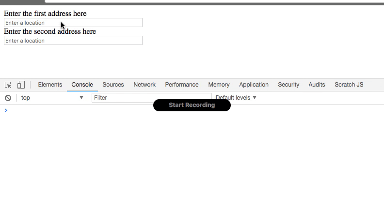

# Google Address Autocomplete
> A library that attaches Google address autocomplete to a text input.



## Dependencies
- [Google Places Library](https://maps.googleapis.com/maps/api/js?key=YOU_GOOGLE_API_KEY_GOES_HERE&libraries=places)

## Installation
```bash
npm install google-address-autocomplete
```

## Usage
There are a couple of ways that you can use the library and both are explained below:

#### 1. As a JS module
You can import the library using the `import` keyword. You will need to make sure that you are using something like Weback to transpile your code, because at this time, browsers do not support import modules.

```JavaScript
import AddressAutocomplete from 'google-address-autocomplete';

// Use a callback here to get the results
new AddressAutocomplete('#my-input-id-or-class-name', (results) => {
  const addressObject = results;

  // This is what the results object looks like
  results = {
    cityName: "Birmingham",
    country: "United States",
    countryAbbr: "US",
    formattedAddress: "123 Shades Crest Rd, Birmingham, AL 35226, USA",
    state: "Alabama",
    stateAbbr: "AL",
    streetName: "Shades Crest Road",
    streetNumber: "123",
    zipCode: "35226",
    coordinates: {
      lat: -123.45678
      lng: 98.76543
    }
  };
});
```

> **NOTE:** There is an optional parameter for adding custom options to the API call. So, it
> look like this:
```JavaScript
const options = {
  componentRestrictions: {country: "us"}
};
new AddressAutocomplete('#my-input-id-or-class-name', options, results => {...});
```
You can use custom options for example, to restrict the search to a specific area (country, region, city, etc.).


> **NOTE:** There is an optional second parameter in the callback function, that will dump out the raw response from Google.
> So, it look like this:
```JavaScript
new AddressAutocomplete('#my-input-id-or-class-name', (results, rawResults) => {...});
```
You can use a callback for both of them to get the results of each.

*Big thanks to [@Braunson](https://github.com/Braunson) for his help with this!*

And include your final bundle in your HTML like this.
```HTML
<!DOCTYPE html>
<html lang="en">
<head>
  <meta charset="UTF-8">
  <meta name="viewport" content="width=device-width, initial-scale=1.0">
  <meta http-equiv="X-UA-Compatible" content="ie=edge">
  <title>Document</title>
</head>
<body>
  <label for="my-input-id-or-class-name">Enter the first address here</label>
  <!-- Here we are giving our input and ID so we can tell autocomplete where to work -->
  <input type="text" id="my-input-id-or-class-name" name="my-input-id-or-class-name" />

  <!-- This is the one external dependency that is needed in order to make this package work -->
  <script src="https://maps.googleapis.com/maps/api/js?key=YOU_GOOGLE_API_KEY_GOES_HERE&libraries=places"></script>
  <script src="js/your-compiled-script-here.js"></script>
</body>
</html>
```

#### 2. Include the compiled script in your HTML
If you are not using something like Webpack to bundle your assets and you just want to use the library on the page, you can use this process.
```HTML
<!DOCTYPE html>
<html lang="en">
<head>
  <meta charset="UTF-8">
  <meta name="viewport" content="width=device-width, initial-scale=1.0">
  <meta http-equiv="X-UA-Compatible" content="ie=edge">
  <title>Document</title>
</head>
<body>
  <label for="my-input-id-or-class-name">Enter the first address here</label>
  <!-- Here we are giving our input and ID so we can tell autocomplete where to work -->
  <input type="text" id="my-input-id-or-class-name" name="my-input-id-or-class-name" />

  <!-- This is the one external dependency that is needed in order to make this package work -->
  <script src="https://maps.googleapis.com/maps/api/js?key=YOU_GOOGLE_API_KEY_GOES_HERE&libraries=places"></script>
  <!--
    You can either point to the node_modules folder or you can copy the file from the node_modules
    and place it in your public directory and use it there. Here, we are pointing to the
    node_modules folder.
  -->
  <script src="../node_modules/google-address-autocomplete/dist/google-address-autocomplete.min.js"></script>
  <script>

    // Now you can use the library as you normally would
    new AddressAutocomplete('#address1', function (result) {
      console.log(result);
    });

    new AddressAutocomplete('#address2', function (result) {
      console.log(result);
    });
  </script>
</body>
</html>
```
> **NOTE:** You can use it for multiple fields on a page like so:
```JavaScript
new AddressAutocomplete('.shipping-address', result => console.log(result));
new AddressAutocomplete('.billing-address', result => console.log(result));
```
Just bind it to all of the form elements that need autocomplete.
## Contributing
See [the contributing guide](./CONTRIBUTING.md)

## Issues
If you find an issue, submit it and let's fix it!

# Contributors
[Check out these awesome people!](https://github.com/dericcain/google-address-autocomplete/graphs/contributors)
